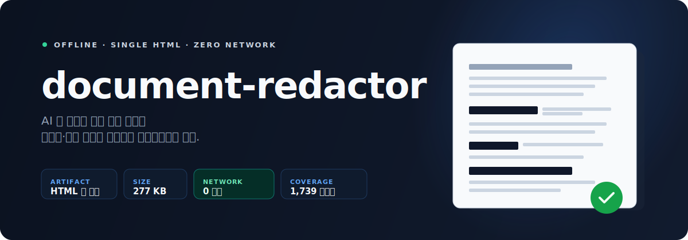
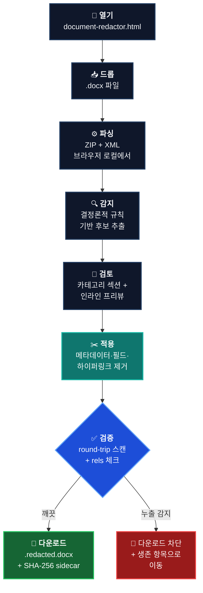

# document-redactor

<p align="center">
  
</p>

<h2 align="center">⬇️ 도구 다운로드</h2>

<table align="center">
  <tr>
    <td align="center" valign="middle">
      <a href="https://github.com/kipeum86/document-redactor/releases/latest/download/document-redactor.html">
        
      </a>
      <br />
      <sub>HTML 한 파일 · ~238 KB · 더블클릭으로 실행</sub>
    </td>
    <td align="center" valign="middle">
      <a href="https://github.com/kipeum86/document-redactor/releases/latest/download/document-redactor.html.sha256">
        
      </a>
      <br />
      <sub>무결성 확인용 · 89 bytes</sub>
    </td>
    <td align="center" valign="middle">
      <a href="https://github.com/kipeum86/document-redactor/releases/latest">
        
      </a>
      <br />
      <sub>릴리즈 노트·과거 버전</sub>
    </td>
  </tr>
</table>

<p align="center">
  <strong>받은 HTML 을 더블클릭</strong> 하면 브라우저에서 바로 열립니다.<br />
  <em>열기 전에</em> <code>shasum -a 256 -c document-redactor.html.sha256</code> <em>로 무결성 확인</em>
</p>

<p align="center">
  <a href="README.md">
    
  </a>
  <a href="USAGE.ko.md">
    
  </a>
  <a href="docs/RULES_GUIDE.md">
    
  </a>
</p>

<p align="center">
  
  
  
  
  
  
  
</p>

<p align="center">
  <strong>법률 문서를 AI에 넣기 전, 로컬에서 먼저 정리하는 오프라인 DOCX 마스킹 도구.</strong><br />
  HTML 파일 하나만 열고, 감지 결과를 검토한 뒤, 검증된 <code>.redacted.docx</code> 를 다운로드하면 됩니다.
</p>

> [!IMPORTANT]
> 이 도구는 AI의 대체제가 아니라 AI 이전 단계입니다. `document-redactor` 는 의도적으로 AI를 쓰지 않습니다. 계약서, 의견서, 준비서면, 메모 같은 문서를 어떤 LLM에 넣기 전에 먼저 로컬에서 정리하는 안전 레이어입니다.

## 한눈에 보기

<table>
  <tr>
    <td width="25%" valign="top">
      <strong>파일 하나</strong><br />
      배포물은 <code>document-redactor.html</code> 하나입니다. 설치 프로그램, 백엔드, 복잡한 asset tree, 자동 업데이트 채널이 없습니다.
    </td>
    <td width="25%" valign="top">
      <strong>규칙 기반</strong><br />
      감지는 결정론적이고, 테스트 가능하며, 추적 가능합니다. 원격 추론도 없고 숨겨진 모델 동작도 없습니다.
    </td>
    <td width="25%" valign="top">
      <strong>로컬 전용</strong><br />
      앱은 <code>file://</code> 페이지로 열리고, 엄격한 CSP와 0-network 런타임 모델 위에서 동작합니다.
    </td>
    <td width="25%" valign="top">
      <strong>검증 우선</strong><br />
      redaction 결과를 맹신하지 않습니다. 생성된 DOCX를 다시 읽고 검사한 뒤에만 다운로드를 허용합니다.
    </td>
  </tr>
</table>

## 어떤 문제를 해결하나

계약서, 준비서면, 내부 메모, 법원 문서를 ChatGPT, Claude, Gemini 같은 도구에 넣고 싶어도 회사명, 인명, 전화번호, 주민등록번호, 계좌정보, 사건번호 같은 민감 문자열이 그대로 들어 있는 경우가 많습니다.

Word에서 수동으로 찾아 바꾸는 방식은 느리고, 반복적이고, 무엇을 놓쳤는지 끝까지 불안합니다.

`document-redactor` 는 그 전처리를 로컬 워크플로로 바꿉니다.

1. 디스크에서 HTML 파일 하나를 엽니다.
2. `.docx` 를 드롭합니다.
3. 카테고리별 후보와 인라인 하이라이트를 검토합니다.
4. redaction을 적용합니다.
5. 검증된 `.redacted.docx` 를 다운로드합니다.

## 이 도구가 무엇이고 무엇이 아닌가

| 이것은 | 이것은 아님 |
|---|---|
| 법률 문서를 위한 오프라인 브라우저 redaction 도구 | 클라우드 redaction 서비스 |
| HTML 한 파일 + 해시 sidecar | 설치형 프로그램, 데스크톱 앱, 백그라운드 서비스 |
| 규칙 기반의 결정론적 review-and-redact 파이프라인 | AI 모델이나 확률적 블랙박스 |
| 산출물과 소스를 직접 감사할 수 있는 제품 | 내부 동작을 추측해야 하는 시스템 |
| AI 이전 단계의 안전 레이어 | AI 도구 자체 |

## 작동 흐름



## 현재 릴리즈 스냅샷

<table>
  <tr>
    <td width="20%" valign="top">
      <strong>배포물</strong><br />
      <code>document-redactor.html</code>
    </td>
    <td width="20%" valign="top">
      <strong>현재 확인된 크기</strong><br />
      238 KB
    </td>
    <td width="20%" valign="top">
      <strong>무결성 sidecar</strong><br />
      89 bytes
    </td>
    <td width="20%" valign="top">
      <strong>런타임 네트워크 호출</strong><br />
      0
    </td>
    <td width="20%" valign="top">
      <strong>자동화 테스트</strong><br />
      1,712 tests
    </td>
  </tr>
</table>

2026년 4월 13일 기준으로 확인한 현재 빌드:

- `document-redactor.html` SHA-256: `5b04c8a8514ea6e045cbc0a7cf9e4db9507cb508f996f88713d4fdb1a6eac866`
- `shasum -a 256 -c document-redactor.html.sha256` 로 로컬 검증 완료

## 현재 릴리즈가 실제로 하는 일

<table>
  <tr>
    <td width="33%" valign="top">
      <strong>로컬 DOCX 순회</strong><br />
      본문, 머리글, 바닥글, 각주, 미주, 댓글, 관계 파일까지 DOCX 패키지를 직접 순회합니다.
    </td>
    <td width="33%" valign="top">
      <strong>구조화된 검토 UX</strong><br />
      당사자, 대리어, 식별자, 금액, 날짜, 조직/인물, 법률 참조, 휴리스틱, catch-all까지 섹션별로 검토할 수 있습니다.
    </td>
    <td width="33%" valign="top">
      <strong>검증 우선 export</strong><br />
      생성된 결과물을 다시 검사하고, 진짜 누출은 차단하며, sanity warning과 leak failure를 분리해 보여줍니다.
    </td>
  </tr>
  <tr>
    <td width="33%" valign="top">
      <strong>인라인 프리뷰</strong><br />
      문서 텍스트 안에서 선택 상태를 보며 검토할 수 있어서, 맥락 없는 리스트 검토보다 훨씬 안전합니다.
    </td>
    <td width="33%" valign="top">
      <strong>OOXML leak hardening</strong><br />
      필드와 hyperlink 구조를 평탄화하고, comments와 metadata를 제거하며, split run 전반에 일관된 redaction을 적용합니다.
    </td>
    <td width="33%" valign="top">
      <strong>수동 복구 경로</strong><br />
      누락된 문자열 추가, surviving item으로 복귀, sanity-only warning override까지 제공하면서도 leak protection은 유지합니다.
    </td>
  </tr>
</table>

공개 detection 카탈로그는 [docs/RULES_GUIDE.md](docs/RULES_GUIDE.md)에서 볼 수 있습니다.

## 왜 이 아키텍처를 선택했나

### 웹서비스 대신 단일 HTML

- 가장 쓰기 쉽습니다. 다운로드 후 더블클릭이면 끝입니다.
- 가장 감사하기 쉽습니다. 배포 산출물이 하나라 확인 대상이 명확합니다.
- 가장 배포하기 쉽습니다. GitHub Releases, USB, 이메일, 카카오톡, 사내 공유 폴더 모두 가능합니다.
- 백엔드가 없으니 서버 측 문서 유출 경로도 생기지 않습니다.

### ML이나 LLM 대신 규칙 기반 엔진

- 민감 문서를 모델 추론에 태울 필요가 없습니다.
- 동작이 결정론적이고 설명 가능합니다.
- 회귀 테스트가 쉽습니다.
- 단일 HTML 산출물을 유지할 만큼 가볍습니다.

중요한 점은, 이 도구는 "AI로 마스킹하는 앱"이 아니라 "AI에 넣기 전에 먼저 돌리는 앱"이라는 점입니다.

### 고수준 문서 추상화 대신 raw OOXML 처리

DOCX는 ZIP 안에 XML part가 들어있는 구조입니다. `JSZip` 과 WordprocessingML 직접 순회를 택했기 때문에:

- Word가 어색하게 쪼개 놓은 run 사이 매치도 다시 붙여서 검사할 수 있고,
- 본문 외 scope까지 넓게 검사할 수 있고,
- 영향받는 부분만 정확히 다시 쓸 수 있고,
- 최종 출력물을 있는 그대로 다시 검증할 수 있습니다.

### Svelte 5 + single-file 번들링

UI는 현대적이어야 하지만 산출물은 작아야 합니다. Svelte 5와 `vite-plugin-singlefile` 조합은:

- 빠른 로컬 인터랙션,
- 작은 런타임,
- 실제 검토 UX를 갖춘 단일 HTML 배포물

을 동시에 만족시킵니다.

## 빠른 시작

### 1. 릴리즈 받기

- [`document-redactor.html`](https://github.com/kipeum86/document-redactor/releases/latest/download/document-redactor.html)
- [`document-redactor.html.sha256`](https://github.com/kipeum86/document-redactor/releases/latest/download/document-redactor.html.sha256)

### 2. 배포물 검증하기

```bash
sha256sum -c document-redactor.html.sha256
# 기대 출력:
# document-redactor.html: OK
```

macOS에서 `sha256sum` 이 없으면:

```bash
shasum -a 256 -c document-redactor.html.sha256
```

### 3. 도구 열기

`document-redactor.html` 을 더블클릭하면 브라우저에서 `file://` 페이지로 열립니다. 설치도 없고 계정도 필요 없습니다.

### 4. redaction 실행

- `.docx` 드롭
- 후보 검토
- `Apply and verify` 클릭
- `{원본}.redacted.docx` 다운로드

자세한 사용법은 [USAGE.ko.md](USAGE.ko.md)를, 영문 사용 가이드는 [USAGE.md](USAGE.md)를 참고하세요.

## 신뢰 모델

| 층위 | 메커니즘 | 왜 중요한가 |
|---|---|---|
| 소스 | ESLint가 `fetch`, `XMLHttpRequest`, `WebSocket`, `EventSource`, `sendBeacon` 같은 primitive를 금지 | 네트워크 코드가 앱에 쉽게 섞이지 못하게 합니다 |
| 빌드 | single-file ship gate가 외부 JS/CSS 참조를 막고 SHA-256 sidecar를 씁니다 | 배포물이 실제로 한 파일인지 강제합니다 |
| 런타임 | 내장 CSP가 `default-src 'none'`, `connect-src 'none'` 를 사용합니다 | 코드가 시도해도 브라우저가 outbound 요청을 차단합니다 |
| export | round-trip verification이 생성된 DOCX를 다시 파싱합니다 | 누출된 결과물을 조용히 내보내지 않도록 합니다 |

> [!NOTE]
> 여기서의 privacy는 선언이 아니라 제약입니다. 소스, 빌드, 런타임, export 검증까지 모두 연결되어 있습니다.

## 기술 스택

| 층위 | 선택 | 왜 이 선택인가 |
|---|---|---|
| 배포 | 단일 `document-redactor.html` + `.sha256` | 가장 검증하기 쉽고 배포하기 쉬운 산출물 |
| 패키지 매니저 | Bun 1.x | 로컬 개발이 빠르고 도구 체인이 가볍습니다 |
| 빌드 | Vite 8 | 플러그인 훅이 명확하고 현대적인 번들링이 가능합니다 |
| 단일 파일 번들링 | `vite-plugin-singlefile` | JS와 CSS를 HTML 하나에 인라인합니다 |
| UI | Svelte 5 | 작은 런타임으로 세밀한 반응형 상태 업데이트를 제공합니다 |
| DOCX 엔진 | `JSZip` + raw OOXML traversal | 읽기, 재작성, 검증을 정확하게 제어하기 위함입니다 |
| 감지 | 규칙 기반 regex + structural classifier | 결정론적이고, 추적 가능하고, 가볍습니다 |
| 검증 | round-trip scan + word-count sanity + SHA-256 | 누출 차단, 과잉 마스킹 경고, 산출물 무결성 확인을 담당합니다 |
| 품질 게이트 | Vitest + strict TypeScript + `svelte-check` | 신뢰가 중요한 제품에 필요한 회귀 방지 체계입니다 |

## 공개 저장소 표면

- 제품 문서: [README.md](README.md), [USAGE.md](USAGE.md), [USAGE.ko.md](USAGE.ko.md), [docs/RULES_GUIDE.md](docs/RULES_GUIDE.md)
- 소스 코드: [`src/`](src)
- 릴리즈 산출물: `document-redactor.html`
- 무결성 파일: `document-redactor.html.sha256`

내부 phase brief와 planning note는 앞으로 공개 git surface에서 제외하는 방향으로 정리하고 있습니다.

## 알려진 제한사항

- DOCX 전용입니다. PDF는 별도 파이프라인이 필요합니다.
- 프리뷰는 검토용이며 Word의 페이지 레이아웃을 픽셀 단위로 복제하지는 않습니다.
- 현재 구현된 redaction level은 `Standard` 하나입니다.
- 이미지 안 텍스트를 위한 OCR은 없습니다.
- embedded OLE object 내부는 순회하지 않습니다.
- SmartArt, WordArt 텍스트는 처리하지 않습니다.

## 개발 워크플로

```bash
git clone https://github.com/kipeum86/document-redactor.git
cd document-redactor
bun install
bun run test
bun run typecheck
bun run lint
bun run build
open dist/document-redactor.html
```

참고:

- 브라우저 QA는 dev server가 아니라 빌드된 `dist/document-redactor.html` 기준으로 보는 게 맞습니다.
- 저장소에는 detection, DOCX rewrite, verification, UI state, ship gate를 포괄하는 1,712개의 자동화 테스트가 있습니다.
- `dist/` 는 git에 올리지 않으므로, 릴리즈는 CI나 검증된 로컬 빌드에서 HTML과 `.sha256` 을 게시해야 합니다.

## 라이선스

[Apache License 2.0](LICENSE)

Built by [@kipeum86](https://github.com/kipeum86).
