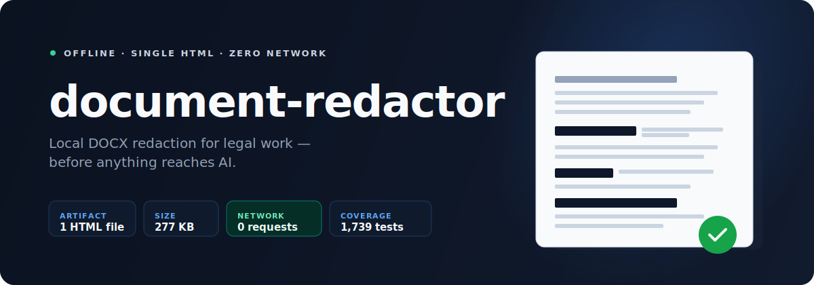
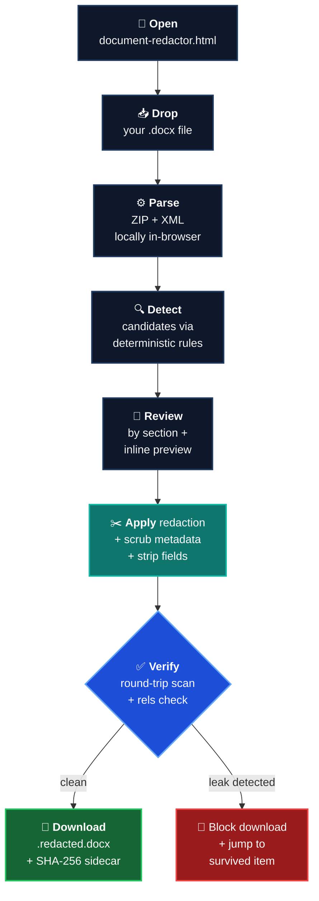

# document-redactor

<p align="center">
  
</p>

<h2 align="center">⬇️ Download the tool</h2>

<table align="center">
  <tr>
    <td align="center" valign="middle">
      <a href="https://github.com/kipeum86/document-redactor/releases/latest/download/document-redactor.html">
        
      </a>
      <br />
      <sub>Single HTML · ~277 KB · open locally</sub>
    </td>
    <td align="center" valign="middle">
      <a href="https://github.com/kipeum86/document-redactor/releases/latest/download/document-redactor.html.sha256">
        
      </a>
      <br />
      <sub>Integrity check · 89 bytes</sub>
    </td>
    <td align="center" valign="middle">
      <a href="https://github.com/kipeum86/document-redactor/releases/latest">
        
      </a>
      <br />
      <sub>Release notes, older builds</sub>
    </td>
  </tr>
</table>

<p align="center">
  <strong>Double-click the downloaded HTML</strong> to open in your browser.<br />
  <em>Verify with</em> <code>shasum -a 256 -c document-redactor.html.sha256</code> <em>first.</em>
</p>

<p align="center">
  <a href="README.ko.md">
    
  </a>
  <a href="USAGE.md">
    
  </a>
  <a href="docs/RULES_GUIDE.md">
    
  </a>
</p>

<p align="center">
  
  
  
  
  
  
  
</p>

<p align="center">
  <strong>Offline DOCX redaction for legal work.</strong><br />
  Open one local HTML file, review deterministic matches, and download a verified <code>.redacted.docx</code><br />
  without sending the source document anywhere.
</p>

> [!IMPORTANT]
> This is the safety step before AI. `document-redactor` is intentionally not AI-powered. It is the local pre-upload filter you run before a contract, memo, pleading, or court document goes into any LLM.

## At A Glance

<table>
  <tr>
    <td width="25%" valign="top">
      <strong>One file</strong><br />
      The shipped product is <code>document-redactor.html</code>. No installer, no backend, no asset tree, no auto-update channel.
    </td>
    <td width="25%" valign="top">
      <strong>Rule-based</strong><br />
      Detection is deterministic, auditable, and regression-testable. No remote inference and no hidden model behavior.
    </td>
    <td width="25%" valign="top">
      <strong>Local-only</strong><br />
      The app opens as a <code>file://</code> page, uses strict CSP, and is built around a zero-network runtime model.
    </td>
    <td width="25%" valign="top">
      <strong>Verified output</strong><br />
      Redaction is not trusted blindly. The output DOCX is re-parsed and checked before download.
    </td>
  </tr>
</table>

## What Problem It Solves

Legal teams increasingly want to send contracts, pleadings, memos, and court documents into AI assistants for summary, issue spotting, or clause review. The blocker is obvious: those files contain company names, people, phone numbers, IDs, bank data, case references, and other strings you should not upload raw.

Manual redaction inside Word is slow, repetitive, and easy to get wrong.

`document-redactor` turns that pre-upload cleanup into a local workflow:

1. Open one HTML file from disk.
2. Drop a `.docx`.
3. Review grouped candidates and inline highlights.
4. Apply redaction.
5. Download a verified `.redacted.docx`.

## What It Is Vs. What It Is Not

| What it is | What it is not |
|---|---|
| An offline browser tool for legal DOCX redaction | A cloud redaction service |
| One downloadable HTML artifact plus a hash sidecar | An installer, daemon, or desktop app |
| A rule-based, deterministic review-and-redact pipeline | An AI model or probabilistic black box |
| A product whose artifact and source can be audited directly | A system you must trust without inspection |
| A pre-AI safety layer | A replacement for your downstream AI assistant |

## The Workflow



## Release Snapshot

<table>
  <tr>
    <td width="20%" valign="top">
      <strong>Artifact</strong><br />
      <code>document-redactor.html</code>
    </td>
    <td width="20%" valign="top">
      <strong>Current checked size</strong><br />
      277 KB
    </td>
    <td width="20%" valign="top">
      <strong>Integrity sidecar</strong><br />
      89 bytes
    </td>
    <td width="20%" valign="top">
      <strong>Runtime network calls</strong><br />
      0
    </td>
    <td width="20%" valign="top">
      <strong>Automated coverage</strong><br />
      1,739 tests
    </td>
  </tr>
</table>

Current checked release artifact on April 14, 2026:

- `document-redactor.html` SHA-256: `323221def9ce105afbd8ea805a5ed7e0751152ec2d531d6dba84111332cd32f9`
- Verified locally with `shasum -a 256 -c document-redactor.html.sha256`

## What The Current Release Does

<table>
  <tr>
    <td width="33%" valign="top">
      <strong>Local DOCX traversal</strong><br />
      Walks body, headers, footers, footnotes, endnotes, comments, and relationship references inside the DOCX package.
    </td>
    <td width="33%" valign="top">
      <strong>Structured review UX</strong><br />
      Groups candidates by parties, aliases, identifiers, amounts, dates, entities, legal references, heuristics, and catch-all additions.
    </td>
    <td width="33%" valign="top">
      <strong>Verification-guided export</strong><br />
      Re-checks the generated output, reports residual survivors clearly, and keeps warnings separate from verified-clean downloads.
    </td>
  </tr>
  <tr>
    <td width="33%" valign="top">
      <strong>Inline preview</strong><br />
      Shows the document text with selection-aware highlights so review happens in context, not in a blind list.
    </td>
    <td width="33%" valign="top">
      <strong>OOXML leak hardening</strong><br />
      Flattens risky field and hyperlink structures, strips comments, scrubs metadata, and normalizes redaction across split runs.
    </td>
    <td width="33%" valign="top">
      <strong>Manual recovery paths</strong><br />
      Lets users add missed strings, jump back to surviving items, and acknowledge residual risk when they still need the file.
    </td>
  </tr>
</table>

For the public detection catalog, see [docs/RULES_GUIDE.md](docs/RULES_GUIDE.md).

## Why This Architecture

### Single HTML instead of a web app

- Easier to use: download once, double-click, redact.
- Easier to audit: one shipped artifact, not a service mesh.
- Easier to distribute: GitHub Releases, USB, email, Kakao, shared drives.
- Easier to trust: no backend means no server-side document path to defend.

### Rule-based instead of ML or an LLM

- Sensitive documents never need model inference.
- Behavior is deterministic and explainable.
- Regression testing is straightforward.
- The artifact stays small enough to remain practical as a local HTML tool.

This choice is deliberate. The AI assistant comes after redaction, not inside it.

### Raw OOXML handling instead of high-level document abstractions

DOCX files are ZIP archives of XML parts. Using `JSZip` plus direct WordprocessingML traversal gives the project the control it needs to:

- detect matches across split text runs,
- scan more than just the body text,
- rewrite only the affected segments,
- verify the exact output it produces.

### Svelte 5 plus single-file bundling

The UI needs to feel modern without blowing up the artifact. Svelte 5 and `vite-plugin-singlefile` give the project:

- fast local interactivity,
- a small runtime footprint,
- one-file packaging that still supports a real review workflow.

## Quick Start

### 1. Download the release

- [`document-redactor.html`](https://github.com/kipeum86/document-redactor/releases/latest/download/document-redactor.html)
- [`document-redactor.html.sha256`](https://github.com/kipeum86/document-redactor/releases/latest/download/document-redactor.html.sha256)

### 2. Verify the artifact

```bash
sha256sum -c document-redactor.html.sha256
# expected output:
# document-redactor.html: OK
```

If `sha256sum` is not available on your Mac:

```bash
shasum -a 256 -c document-redactor.html.sha256
```

### 3. Open the tool

Double-click `document-redactor.html`. It opens as a `file://` page in your browser. There is no install step and no account setup.

### 4. Run a redaction

- Drop a `.docx`
- Review candidates
- Click `Apply and verify`
- Download `{original}.redacted.docx`

For a detailed walkthrough, see [USAGE.md](USAGE.md). For the Korean guide, see [USAGE.ko.md](USAGE.ko.md).

## Trust Model

| Layer | Mechanism | Why it matters |
|---|---|---|
| Source | ESLint bans `fetch`, `XMLHttpRequest`, `WebSocket`, `EventSource`, `sendBeacon`, and similar primitives | Network code is stopped before it casually enters the app |
| Build | Single-file ship gate rejects external JS or CSS references and writes a SHA-256 sidecar | The release stays auditable as one artifact |
| Runtime | Embedded CSP uses `default-src 'none'` and `connect-src 'none'` | The browser blocks outbound requests at execution time |
| Export | Round-trip verification re-parses the generated DOCX | The app does not silently ship a leaky output |

> [!NOTE]
> The privacy story here is not just policy language. It is enforced in source code, build rules, runtime policy, and export verification.

## Tech Stack

| Layer | Choice | Why this choice |
|---|---|---|
| Distribution | Single `document-redactor.html` + `.sha256` | Simplest release artifact and easiest thing to verify |
| Package manager | Bun 1.x | Fast local workflow and a light toolchain |
| Build | Vite 8 | Clear plugin hooks and dependable modern bundling |
| Single-file packaging | `vite-plugin-singlefile` | Inlines JS and CSS into one shipped HTML file |
| UI | Svelte 5 | Fine-grained reactivity with a small runtime |
| DOCX engine | `JSZip` + raw OOXML traversal | Precise control over read, rewrite, and verify |
| Detection | Rule-based regex + structural classifiers | Deterministic, inspectable, lightweight |
| Verification | Round-trip scan + word-count sanity + SHA-256 | Catches leaks, flags suspicious over-redaction, verifies artifacts |
| Quality gates | Vitest + strict TypeScript + `svelte-check` | Strong regression safety for a trust-sensitive product |

## Public Repo Surface

- Product docs: [README.ko.md](README.ko.md), [USAGE.md](USAGE.md), [USAGE.ko.md](USAGE.ko.md), [docs/RULES_GUIDE.md](docs/RULES_GUIDE.md)
- Source: [`src/`](src)
- Release output: `document-redactor.html`
- Integrity file: `document-redactor.html.sha256`

Internal phase briefs and planning notes are intentionally being removed from the public git surface going forward.

## Known Limitations

- DOCX only. PDF requires a different pipeline.
- The preview is review-oriented, not a pixel-faithful Word layout clone.
- `Standard` is the only implemented redaction level today.
- No OCR for text embedded inside images.
- No traversal into embedded OLE objects.
- No SmartArt or WordArt extraction.

## Developer Workflow

```bash
git clone https://github.com/kipeum86/document-redactor.git
cd document-redactor
bun install
bun run test
bun run typecheck
bun run lint
bun run build
open dist/document-redactor.html
```

Notes:

- For browser QA, test the built `dist/document-redactor.html`, not the dev server.
- The repository currently carries 1,712 automated tests across detection, DOCX rewriting, verification, UI state, and ship gates.
- `dist/` is ignored in git; releases should publish the built HTML and its `.sha256` sidecar from CI or from a verified local build.

## License

[Apache License 2.0](LICENSE)

Built by [@kipeum86](https://github.com/kipeum86).
