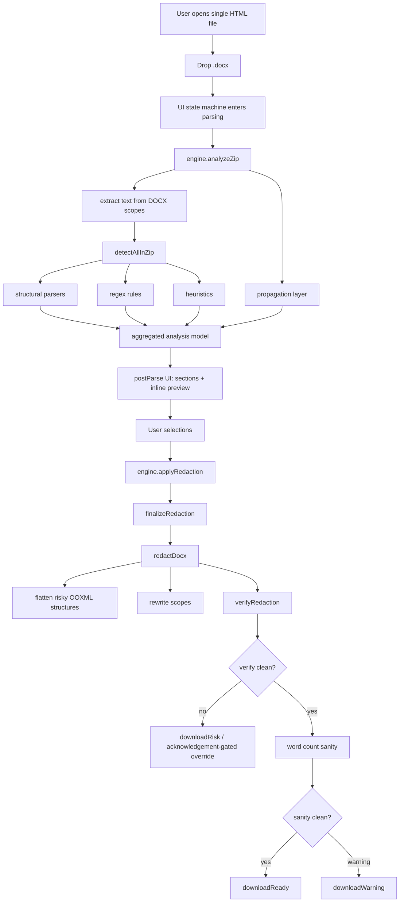

# Project Review Brief — `document-redactor`

## Purpose of this document

This brief is meant for an external technical reviewer, especially a frontier reasoning model with long-context code-audit capability, that is being asked to review the project as a whole.

The goal is to make the project understandable without requiring the reviewer to reverse-engineer the repository from scratch.

This document focuses on:

- product purpose,
- architectural constraints,
- end-to-end flow,
- module boundaries,
- safety model,
- current tradeoffs,
- the specific kinds of feedback that would be most useful.

For a deeper explanation of the rule engine itself, read the companion document:

- [rule-engine-review-brief.md](./rule-engine-review-brief.md)

---

## 1. One-paragraph summary

`document-redactor` is an offline browser tool that redacts sensitive strings from `.docx` files before those files are uploaded to AI assistants or shared externally.

It ships as a single local HTML file, performs detection and review entirely in the browser, rewrites DOCX XML directly, and re-verifies the generated output before allowing download. The core design principle is not “high recall at any cost,” but “make leaks detectable and block export when a selected sensitive string survives.”

---

## 2. Product constraints that drive the architecture

These constraints are not cosmetic. They are load-bearing.

### 2.1 Offline and local-only

The product must work as a `file://` page with no server dependency.

Implications:

- no backend,
- no API round-trips,
- no model inference,
- no asset loading at runtime,
- no auth or account system.

### 2.2 Single-file distribution

The shipped product is one HTML file:

- `document-redactor.html`

plus one integrity sidecar:

- `document-redactor.html.sha256`

Implications:

- the build must inline JS and CSS,
- the output must remain reasonably small,
- the release artifact must be easy to hash and audit.

### 2.3 Zero-network runtime

The trust story depends on the app being unable to phone home.

Implications:

- source-level network primitives are banned,
- build output is checked for external script/style references,
- CSP blocks outbound connections at runtime,
- reviewers are expected to treat any network-capable path as a product-breaking defect.

### 2.4 Deterministic, auditable detection

The product intentionally uses rules, not ML, for candidate discovery.

Implications:

- same input should produce same candidates,
- false negatives matter more than elegance,
- behavior should be explainable from code,
- performance and ReDoS resistance matter because rules run locally.

### 2.5 Verification is part of the product, not an afterthought

Detection and redaction are not trusted blindly.

Implications:

- the output DOCX is re-parsed,
- literal sensitive targets are searched again,
- download is blocked on surviving strings,
- the verifier is intentionally simpler than the detector.

---

## 3. What the user actually does

From the user’s perspective, the product flow is:

1. Open one local HTML file.
2. Drop a `.docx`.
3. Review automatically detected candidates in grouped UI sections and inline preview.
4. Toggle what should be redacted.
5. Apply redaction.
6. If verification is clean, download the `.redacted.docx`.
7. If verification fails, go back to review with surviving strings highlighted.

The tool is positioned as the safety step **before** sending a document to ChatGPT, Claude, Gemini, or another LLM.

---

## 4. End-to-end architecture



---

## 5. Repository layout

The project is intentionally split into a few narrow layers.

| Layer | Directory | Responsibility |
|---|---|---|
| Detection | [`src/detection/`](../../src/detection) | Extract text from DOCX scopes, detect candidates with structural parsers, regex rules, and heuristics |
| Propagation | [`src/propagation/`](../../src/propagation) | Seed-driven alias propagation and defined-term handling |
| DOCX rewrite | [`src/docx/`](../../src/docx) | Scope walking, coalescing, mutation, metadata scrubbing, verification |
| Finalization | [`src/finalize/`](../../src/finalize) | Orchestrates redaction, word-count sanity, deterministic bytes, SHA-256 |
| UI engine | [`src/ui/engine.ts`](../../src/ui/engine.ts) | Adapts pure pipeline modules into UI-facing analysis/apply APIs |
| UI state and components | [`src/ui/`](../../src/ui) | State machine, review UI, inline preview, banners, controls |
| Packaging | [`vite.config.ts`](../../vite.config.ts) | Single-file build, CSP assertions, size cap, release sidecar hash |

---

## 6. Important concepts

### 6.1 Scope

A DOCX is not treated as one blob. The app walks multiple text-bearing scopes, including:

- body,
- headers,
- footers,
- footnotes,
- endnotes,
- comments,
- relationship files for hyperlink-related leaks.

This matters because many leak vectors do not live only in `word/document.xml`.

### 6.2 Candidate

A candidate is a literal string that the UI can present for review and that may become a redaction target.

The detection layer produces:

- regex candidates with confidence `1.0`,
- heuristic candidates with confidence `< 1.0`,
- structural definitions as side-channel context rather than immediate redaction targets.

### 6.3 Structural definition

A structural parser can emit “label → referent” mappings like:

- `the Buyer` → `ABC Corporation`
- `매수인` → `사과회사`

These are used to preserve readability and avoid treating generic defined-role terms as ordinary literals by default.

### 6.4 Finalized report

The last step returns a report containing:

- verify result,
- scope mutation summary,
- word-count sanity result,
- SHA-256 hash,
- output bytes.

This report directly drives the UI’s final states.

---

## 7. Current runtime states in the UI

The app uses a small, explicit state machine in [`src/ui/state.svelte.ts`](../../src/ui/state.svelte.ts).

Primary states:

- `idle`
- `parsing`
- `postParse`
- `redacting`
- `repairing`
- `downloadReady`
- `downloadRepaired`
- `downloadWarning`
- `downloadRisk`
- `fatalError`

This is important because review feedback about the UI should understand that “warning” and “fail” are intentionally different product outcomes:

- `downloadRisk` means sensitive strings survived; download requires explicit acknowledgement and must not be presented as verified clean.
- `downloadWarning` means no leak was found, but the word-count sanity threshold was exceeded.

---

## 8. Detection and redaction are intentionally decoupled

One of the most important architectural decisions is that detection is not the same thing as mutation.

### Detection side

The detection layer works on extracted text and produces candidate strings.

Relevant files:

- [`src/detection/detect-all.ts`](../../src/detection/detect-all.ts)
- [`src/detection/_framework/runner.ts`](../../src/detection/_framework/runner.ts)

### Mutation side

The redaction layer re-opens the DOCX package, rewrites XML scopes, removes leak vectors like comments and fields, and verifies the output independently.

Relevant files:

- [`src/docx/redact-docx.ts`](../../src/docx/redact-docx.ts)
- [`src/docx/redact.ts`](../../src/docx/redact.ts)
- [`src/docx/verify.ts`](../../src/docx/verify.ts)
- [`src/finalize/finalize.ts`](../../src/finalize/finalize.ts)

This separation is deliberate. A reviewer should not assume that “better detection” automatically means “safe export.”

---

## 9. Trust and safety model

The project’s trust model is layered.

### 9.1 Source-level network bans

The codebase uses lint restrictions so network primitives are not casually introduced.

### 9.2 Build-level single-file gate

The Vite config enforces:

- one-file output,
- CSP presence,
- no external script or stylesheet references,
- a 3 MB bundle cap,
- SHA-256 sidecar generation.

See:

- [`vite.config.ts`](../../vite.config.ts)

### 9.3 Runtime CSP

The app relies on strict CSP to block outbound connections at runtime.

### 9.4 Independent verifier

The verifier deliberately avoids cleverness. It reloads the output and runs literal `indexOf` checks over scope XML and `.rels` files.

This is arguably the most important nontrivial safety mechanism in the entire product.

See:

- [`src/docx/verify.ts`](../../src/docx/verify.ts)

---

## 10. Detection pipeline summary

The current detection pipeline is three-phase:

1. Structural parsers
2. Regex rules
3. Heuristics

Detection is run per extracted text scope, not as one monolithic whole-document pass.

The app currently ships:

- 9 identifier rules
- 10 financial rules
- 8 temporal rules
- 16 entity rules
- 6 legal rules
- 5 structural parsers
- 4 heuristics

Detailed rule-engine explanation is in:

- [rule-engine-review-brief.md](./rule-engine-review-brief.md)

---

## 11. Propagation layer

The repository still contains a propagation layer for seed-driven alias expansion and D9 defined-term behavior:

- [`src/propagation/propagate.ts`](../../src/propagation/propagate.ts)

Important nuance:

- the current public UI has no seed-entry workflow or `AppState` seed API,
- main parties are expected to be caught via structural and entity rules,
- manual additions act as a fallback,
- propagation remains a reusable and test-covered subsystem.

An external reviewer may reasonably ask whether propagation is still central enough to justify its footprint. That is a fair review question.

---

## 12. Current known tradeoffs

These are not necessarily bugs, but they are deliberate product tradeoffs.

### 12.1 Rule-based instead of ML

Pros:

- deterministic,
- auditable,
- smaller artifact,
- no model path,
- easier local execution.

Cons:

- more manual rule maintenance,
- more explicit taxonomy and regex design work,
- some recall gaps need either new rules or manual catch-all additions.

### 12.2 Preview is inspection-oriented, not Word-layout-faithful

The preview is meant to help review text in context, not to recreate Word page layout pixel-for-pixel.

### 12.3 Standard mode only

The UI still has a level concept, but only `Standard` is effectively implemented as product behavior today.

### 12.4 DOCX-only

PDF is out of scope because it would require a fundamentally different extraction and mutation pipeline.

---

## 13. What an external reviewer should focus on

The most useful review is not general admiration or generic style feedback. It is targeted critique in these areas:

### 13.1 Correctness risks

- Could sensitive strings survive in scope types or XML structures the app does not cover?
- Are there mismatches between what the UI shows and what the redactor actually uses?
- Are there places where candidate aggregation or dedup could silently hide a needed target?

### 13.2 Safety-model weaknesses

- Does any code path weaken the zero-network claim?
- Are there release/build conditions where the shipped artifact could violate assumptions the README makes?
- Is the verifier truly independent enough from the redactor?

### 13.3 Architecture and maintainability

- Are the boundaries between detection, propagation, mutation, and UI clean enough?
- Is there accidental duplication between old and new paths?
- Are there modules that should be simplified or collapsed?

### 13.4 Test gaps

- Which high-risk behaviors are insufficiently tested?
- Which integration seams are more fragile than the current tests reflect?

### 13.5 Performance / regex safety

- Any likely ReDoS or pathological matching patterns?
- Any phase-ordering or normalization decisions that could create expensive behavior on larger files?

---

## 14. Key files to inspect first

If the reviewer does not want to read the whole repo, these are the best starting points.

### Product architecture

- [`README.md`](../../README.md)
- [`vite.config.ts`](../../vite.config.ts)
- [`src/ui/App.svelte`](../../src/ui/App.svelte)
- [`src/ui/state.svelte.ts`](../../src/ui/state.svelte.ts)
- [`src/ui/engine.ts`](../../src/ui/engine.ts)

### Detection

- [`src/detection/detect-all.ts`](../../src/detection/detect-all.ts)
- [`src/detection/_framework/runner.ts`](../../src/detection/_framework/runner.ts)
- [`src/detection/_framework/registry.ts`](../../src/detection/_framework/registry.ts)
- [`src/detection/_framework/types.ts`](../../src/detection/_framework/types.ts)

### DOCX mutation and verification

- [`src/docx/redact-docx.ts`](../../src/docx/redact-docx.ts)
- [`src/docx/redact.ts`](../../src/docx/redact.ts)
- [`src/docx/verify.ts`](../../src/docx/verify.ts)
- [`src/finalize/finalize.ts`](../../src/finalize/finalize.ts)

### Rule definitions

- [`src/detection/rules/identifiers.ts`](../../src/detection/rules/identifiers.ts)
- [`src/detection/rules/financial.ts`](../../src/detection/rules/financial.ts)
- [`src/detection/rules/temporal.ts`](../../src/detection/rules/temporal.ts)
- [`src/detection/rules/entities.ts`](../../src/detection/rules/entities.ts)
- [`src/detection/rules/legal.ts`](../../src/detection/rules/legal.ts)

---

## 15. Suggested prompt for a frontier reasoning model

You can paste something close to this:

```text
Please review this project architecture as a safety-critical offline document redaction tool.

Read this compact context first:
- docs/review/agent-context.compact.md

Then read these two briefs as needed:
- docs/review/project-review-brief.md
- docs/review/rule-engine-review-brief.md

Then inspect the referenced files directly in the repository.

Focus on:
1. correctness risks that could lead to surviving leaks,
2. architectural weaknesses or unnecessary complexity,
3. mismatches between UI behavior and actual redaction behavior,
4. zero-network / single-file trust-model weaknesses,
5. test gaps,
6. rule-engine design risks, especially around normalization, dedup, language filtering, heuristics, and regex safety.

Every finding must use this schema:
- severity: P0 | P1 | P2
- dimension: correctness | safety | architecture | performance | prompt | docs
- evidence: file:line
- problem
- impact
- proposed_fix
- tests_to_add

Do not include praise or generic observations. If something is a tradeoff rather than a bug, say so explicitly. If a claim has no file/line evidence, put it under assumptions instead of findings.
```

---

## 16. Version/context snapshot

At the time this brief was written:

- package version: `1.1.1`
- build artifact: single-file `document-redactor.html`
- current checked build size: `256 KB`
- test suite scale: `1,788` tests

This brief is intentionally architecture-focused rather than commit-specific.
